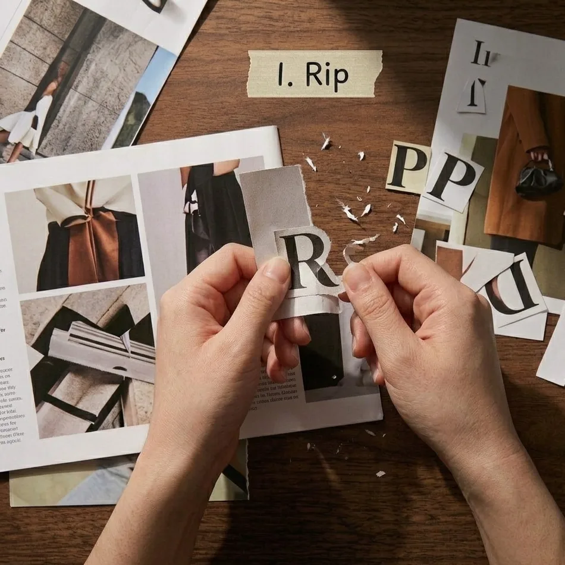
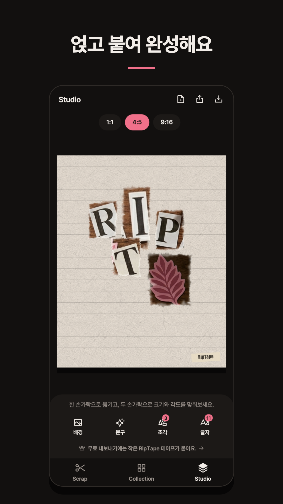
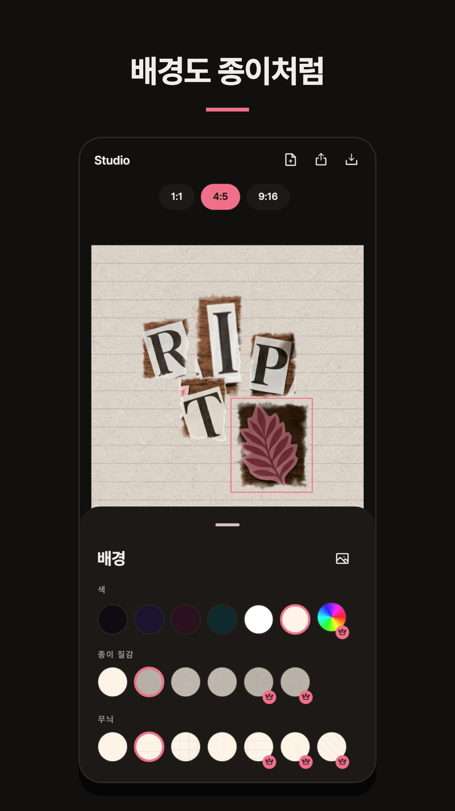
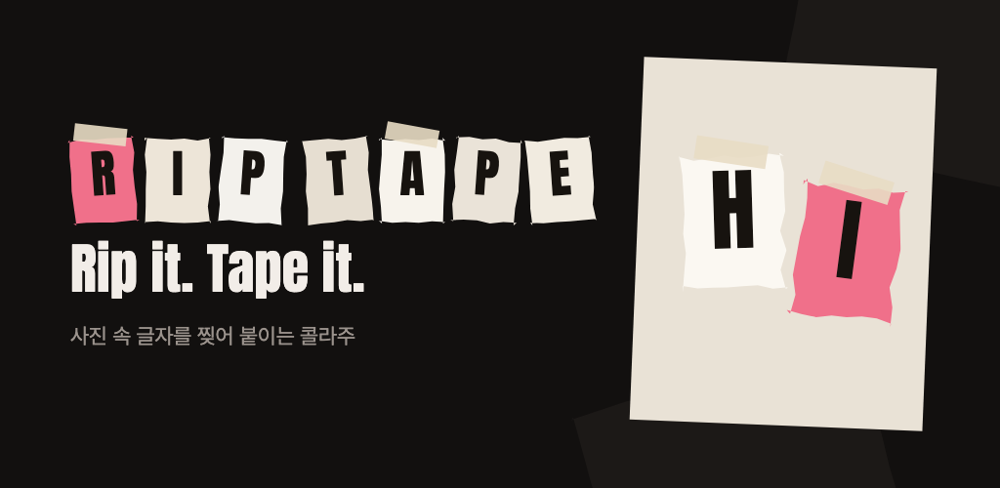

두 번째 앱 **RipTape**을 출시했습니다. 사진 속 글자나 모양을 손가락으로 따라 그리면 그 모양대로 찢겨 나오고, 그 조각들을 배경 위에 붙여 콜라주를 만드는 앱입니다.

만들면서 가장 오래 붙들고 있었던 건 새로운 기능이 아니었습니다. **버그처럼 보이는 것을 고치지 않기로 하는 결정**이었습니다.

## 딸려 오는 배경을 지우지 않았다

간판에서 'R'을 오려내면 글자만 깔끔하게 나오지 않습니다. 글자 주변의 벽, 하늘 한 조각, 벽지 귀퉁이가 같이 딸려 옵니다. 처음 시험판을 만들었을 때 이게 제일 먼저 눈에 걸렸습니다. 배경 제거 모델을 붙이면 몇 줄로 해결되는 문제이기도 했습니다.

그런데 조각을 여러 개 모아 배경 위에 늘어놓아 보니 생각이 바뀌었습니다. **딸려 온 배경이 있어야 잡지에서 오려낸 종이처럼 보였습니다.** 배경을 깨끗하게 지운 글자는 종이가 아니라 스티커였습니다. 실제로 잡지를 가위로 오려 본 사람은 압니다 — 글자 윤곽선을 따라 정확히 오리는 사람은 없습니다. 대충 네모나게 오리고, 그 주변 종이가 같이 붙어 있는 게 콜라주입니다.

위 화면에서 글자마다 갈색 종이가 네모나게 붙어 있는 게 보이실 겁니다. 원본 사진의 나무 책상이 딸려 온 것입니다. 이걸 지우면 깔끔해지지만, 동시에 종이가 아니게 됩니다.

그래서 이건 **고칠 버그가 아니라 지킬 특성**으로 정했습니다. 문서에 그렇게 적어두고, 나중에 "이거 배경 지워야 하는 거 아니냐"는 생각이 다시 들 때마다 그 문장을 다시 읽었습니다.

덕분에 앱에는 AI가 들어가지 않았습니다. 모델을 돌릴 서버도, 추론 시간도, 인터넷 연결도 필요 없습니다. 비행기 모드에서 완전히 동작합니다.

## 계정도 서버도 없다

[피싱레코드](/projects/fishingrecord)와 같은 원칙을 이어갔습니다. 회원가입, 로그인, 클라우드 동기화가 없습니다. 사진과 조각과 콜라주는 전부 기기 안에만 있습니다.

이게 편의를 포기한 결정처럼 보이지만, 실제로는 반대였습니다.

- **사진을 다루는 앱에서 "서버로 안 보냅니다"는 말은 신뢰를 사는 데 비용이 가장 적게 드는 방법**입니다. 보낼 곳이 없으면 유출될 수도 없습니다.
- 서버가 없으니 운영비가 0원입니다. 1인 스튜디오가 앱을 오래 유지하는 데 이만한 조건이 없습니다.
- 대신 **백업은 스스로 책임져야 합니다.** 사진까지 전부 담은 파일 하나로 내보내고 되돌리는 기능을 넣었고, 파일 안에 형식 버전을 박아 두어 나중에 구조가 바뀌어도 예전 백업을 읽을 수 있게 했습니다.

구글 자동 백업은 **껐습니다.** 자동 백업은 25MB까지만 담는데, 조각 이미지가 그보다 커지면 데이터베이스와 설정만 복원되고 이미지가 빠집니다. 카드는 있는데 그림이 없는 반쯤 깨진 상태로 복원되느니, 아예 복원하지 않고 앱 안의 백업 파일 하나로만 되돌리는 편이 낫다고 판단했습니다.

## 유료 기능을 못 써보면 사고 싶어지지 않는다

Pro 기능(종이 질감, 무늬, 배경색 직접 고르기, 2배 해상도)을 처음에는 흔한 방식대로 막아 두었습니다. 자물쇠를 걸고, 누르면 결제 화면으로 보내는 식으로요.

직접 써 보니 **사고 싶은 마음이 전혀 생기지 않았습니다.** 적용했을 때 뭐가 어떻게 달라지는지 모르는 채로 결제 화면만 보게 되니까요. 잠긴 재료가 예쁜지 아닌지도 알 수 없었습니다.

그래서 뒤집었습니다.

1. **잠긴 재료도 눌러서 캔버스에 적용해 볼 수 있습니다.** 실제 작업물 위에 얹혀서 어떻게 보이는지 그대로 확인됩니다.
2. 대신 캔버스 구석에 작은 표시가 뜹니다 — 지금 미리보기 중이라는 신호입니다. 이게 없으면 저장할 때 처음 알게 되는데, 그건 매복입니다.
3. 저장이나 공유를 누르면 그때 물어봅니다. **"무료 재료로 바꿔서 저장" 또는 "Pro 구매".** 만들던 작업물을 인질로 잡지 않는 게 중요했습니다. 취소하고 무료로 저장하는 길을 항상 열어 둡니다.
4. 스크린샷으로 우회하는 것까지는 막지 않았습니다. 막으려면 화면을 가려야 하는데, 그건 사려는 사람까지 불편하게 만듭니다.

무료로 내보낸 결과물에는 구석에 작은 테이프 표시가 붙습니다. 이건 **지우는 기능이 아니라 선택권으로 팔았습니다.** 실제로 테이프가 예뻐서 Pro가 되고도 그대로 붙여 두는 경우가 있어서, Pro의 기본값도 **붙은 상태**로 두고 떼는 걸 사용자가 고르게 했습니다. 결제하자마자 말없이 사라지면 무엇이 바뀌었는지 보이지 않으니까요.

## 브랜드 자료를 코드로 그렸다

Play 스토어에 올릴 피처 그래픽(1024×500)을 이미지 편집기로 만들지 않고 **앱 코드로 그렸습니다.** 찢은 종이 위젯, 마스킹테이프 위젯, 앱이 쓰는 서체를 그대로 가져다 화면을 구성하고, 테스트로 렌더해서 PNG로 뽑았습니다.

위 이미지는 이미지 편집기에서 만든 게 아니라, 앱을 실행해 찍어낸 것입니다. 글자를 얹은 종이 조각 하나하나가 앱 안에서 실제로 쓰이는 위젯입니다.

이유는 하나입니다. **손으로 만든 이미지는 앱과 어긋납니다.** 앱의 색을 바꾸면 스토어 이미지는 그대로 남아 있고, 몇 달 뒤에는 둘이 다른 제품처럼 보입니다. 코드에서 같은 재료로 그리면 색을 바꾸는 순간 둘이 함께 바뀝니다.

스크린샷도 같은 방식입니다. 목업 템플릿에 화면을 끼워 넣는 대신 **실제 앱을 테스트 환경에서 띄워 찍었습니다.** 화면에 보이는 조각들도 앱의 실제 오려내기 코드로 사진에서 뜯어낸 것입니다. UI가 바뀌면 테스트를 다시 돌리는 것만으로 스토어 스크린샷이 따라옵니다.

## 만들면서 배운 것

**테스트가 흔들리는 걸 방치하면 안 됩니다.** 출시 전 전수 점검에서 테스트가 가끔 실패하는 걸 발견했습니다. 원인은 기능이 아니라 여러 테스트 파일이 같은 데이터베이스 경로를 공유해서 서로 잠금을 물고 있었던 것이었습니다. 실패가 뜰 때마다 다시 돌려서 넘어갔다면 진짜 버그가 섞여 들어왔을 때 구분하지 못했을 겁니다.

**에셋을 코드에서 참조했다고 등록된 건 아닙니다.** 온보딩 이미지 세 장이 코드에서는 불려지는데 `pubspec.yaml` 에는 빠져 있었습니다. 테스트는 전부 통과했고, 실제 기기에서 열어 봤을 때만 회색 오류 상자가 떴을 겁니다. 출시 직전 점검 목록에 "빌드 산출물을 직접 뜯어서 확인"을 넣어 둔 게 이걸 잡았습니다.

**되돌릴 수 없는 것부터 확인해야 합니다.** 패키지명은 업로드 후 영구히 못 바꾸고, 인앱 상품 ID는 삭제해도 재사용할 수 없으며, 무료로 게시한 앱은 유료로 바꿀 수 없습니다. 이 세 가지는 코드를 고치는 일보다 먼저 결정했어야 하는 것들이었고, 실제로 패키지명은 출시 직전에야 스튜디오 이름에서 앱 이름으로 바로잡았습니다.

## 지금 상태

Android 로 먼저 출시합니다. Flutter 로 만들었고 iOS 도 빌드되지만, 두 스토어를 동시에 챙기는 것보다 한쪽에서 반응을 보는 편이 낫다고 판단했습니다.

RipTape 이 궁금하시면 Play 스토어에서 받아보실 수 있습니다. 개인정보처리방침은 [여기](/privacy/riptape)에 있습니다 — 짧습니다. 수집하는 게 없으면 쓸 말도 별로 없더군요.
